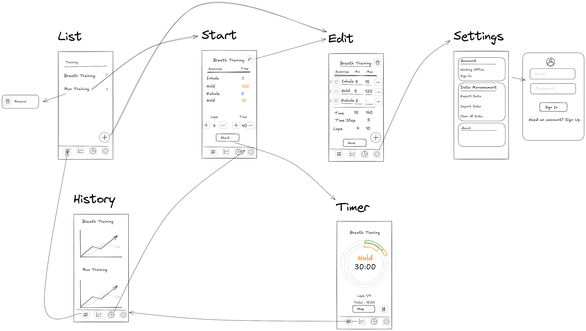

# Bearth Timer

A simple and customizable breath-hold timer app for freediving and breathwork, built with Flutter.

## Features

* Customizable inhale, hold, exhale, and rest intervals
* Minimalist, mobile-friendly interface
* For both beginners and experienced users
* Works on Android, iOS, and web

## Getting Started

1. Clone the repository.
2. Run the app using Flutter:

   ```sh
   flutter run
   ```
3. Set your desired intervals and press "Start Timer" to begin your session.

## Exercise Info

Based on exercises by Alexey Molchanov:
[Watch the video](https://youtu.be/l68vM9t7oc0?si=Rq-jibNS1KY3lG1Q)

Full text instructions in multiple languages can be found in the [docs](./docs) folder.

## 🛠️ Setup and Running

1.  **Prerequisites:**
    *   Flutter SDK installed.
    *   A configured IDE (like VS Code) or command line.
    *   A microphone connected and enabled on your device/computer.

2.  **Clone the Repository:**
    ```bash
    git clone https://github.com/konyshevgmbh/bearth_timer.git
    cd bearth_timer
    ```

3.  **Get Dependencies:**
    ```bash
    flutter pub get
    ```

4.  **Run the Game:**
    *   **Mobile (Android/iOS):**
        ```bash
        flutter run
        ```
        Ensure you grant microphone permissions when prompted by the app.
    *   **Web:**
        ```bash
        flutter run -d chrome --web-renderer html
        ```
        Your browser will likely ask for microphone permission for the site. The `html` renderer is often better for microphone access consistency on the web with `flutter_recorder`.
    *   **Desktop (Windows/macOS/Linux):**
        ```bash
        flutter run -d windows  # or -d macos / -d linux
        ```
        Ensure microphone permissions are granted at the OS level.
        
        **Linux Audio Dependencies:** For audio playback on Linux, you may need to install additional packages:
        ```bash
        sudo apt-get install libasound2-dev pulseaudio
        ```
5.  **Updating App Icons:**
        
    ```bash
    dart run flutter_launcher_icons
    ```
    Fix circular Android icons using [Icon Kitchen](https://icon.kitchen/).

6. **Translations:**
   dart run slang  
    See [slang documentation](https://pub.dev/packages/slang) for details.

7. **UI Mockups:** 
    UI Mockups created with https://excalidraw.com/ 
    

8. Concept Local First:
    https://www.inkandswitch.com/essay/local-first/

    TODO implement CRDT, but for now use simple solution with createdAt, updatedAt and deletedAt timestamp.
## Contributing

Open issues or pull requests for suggestions or improvements.

## License

MIT License

https://play.google.com/store/apps/details?id=com.konyshevgmbh.bearth_timer

